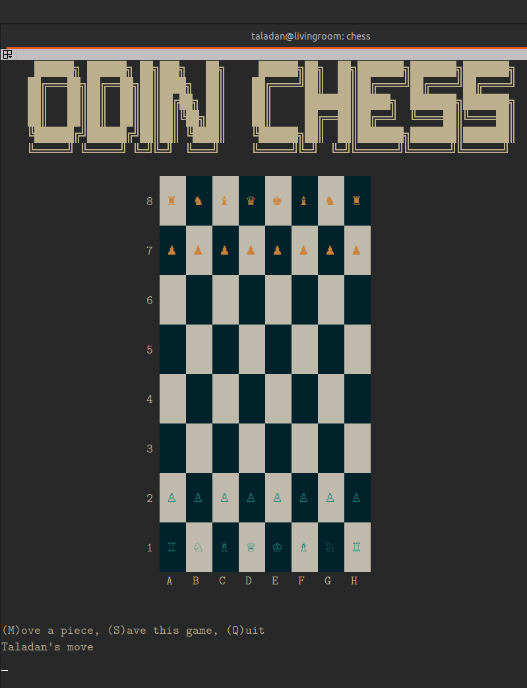

# chess

The game of Kings, at the commandline.

## Project Info

This is a project assignment for [The Odin Project](https://theodinproject.com)

[Learn to Play](https://www.chess.com/learn-how-to-play-chess)

## Needed gem

To play this game, you will need to install the 'colorize' gem

`gem install colorize`

## Caveats

This game is functionally playable and done! There is no defined 'draw' condition at this point, though I'll likely get around to adding one eventually. I would also like to implement a way for users to delete save files from within the game without having to remove them by hand at the CLI.

However, this game meets the basic assignment spec from The Odin Project, so as stated before, it's functionally done.

One thing to look out for, as I currently have it written, there is a large lag spike within the game whenever a king is checked/checkmated because of the way I have to run the moves to test for the difference between check and mate. This is a known issue and I'm seeking advice for it - if you have any ideas, please sub an issue and let me know.

I hope you enjoy!
